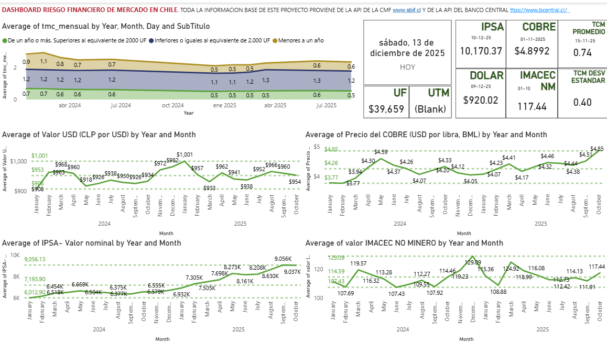

ESTE PROYECTO TIENE COMO OBETIVO DAR UNA PERSPECTIVA GENERAL DEL RIESGO FINANCIERO EN CHILE USANDO COMO FUENTES DE DATOS API'S PUBLICAS DE LA CMF, EL BANCO CENTRAL Y OTROS.

DASHBOARD 1, RIESGO FINANCIERO DE MERCADO ENERO 2024 - OCTUBRE 2025, VALORES ACTUALES AL 13-12-25 DE ACUERDO A FUENTES.

El IMACEC, no minero, muestra un crecimiento promedio cercano al 14% en el mercado interno, aunque con una alta variabilidad a lo largo del tiempo. Esta inestabilidad puede resultar preocupante para empresas que dependen del consumo interno de bienes y servicios, ya que dificulta la planificación y proyección de la demanda.

La Tasa Máxima Convencional presenta una relativa estabilidad en sus niveles durante los últimos dos años, lo que no resulta extraño considerando que la política monetaria de la FED se ha mantenido restrictiva en un contexto global VUCA. Sin embargo, se observa una desviación estándar amplia entre los distintos tipos de tasas en Chile, lo que incrementa la volatilidad del costo financiero y genera incertidumbre respecto al rango de intereses que deben asumir las empresas al apalancarse según la operación.

El precio del cobre se mantiene sólido y con una clara tendencia al alza, reafirmando su rol histórico como principal soporte macroeconómico del país. En contraste, el IPSA muestra un desempeño contenido durante el año 2024, pero evidencia una activación significativa y una pendiente de crecimiento pronunciada durante 2025, alcanzando niveles históricamente altos hacia el cierre del año.

El comportamiento del dólar resulta errático y guarda similitudes con la evolución del IMACEC no minero. Este patrón no es inesperado, considerando que el tipo de cambio se encuentra fuertemente influenciado por tensiones geopolíticas y por la actual disputa de poder en el escenario económico global.

13-12-2025 proyecto en proceso...