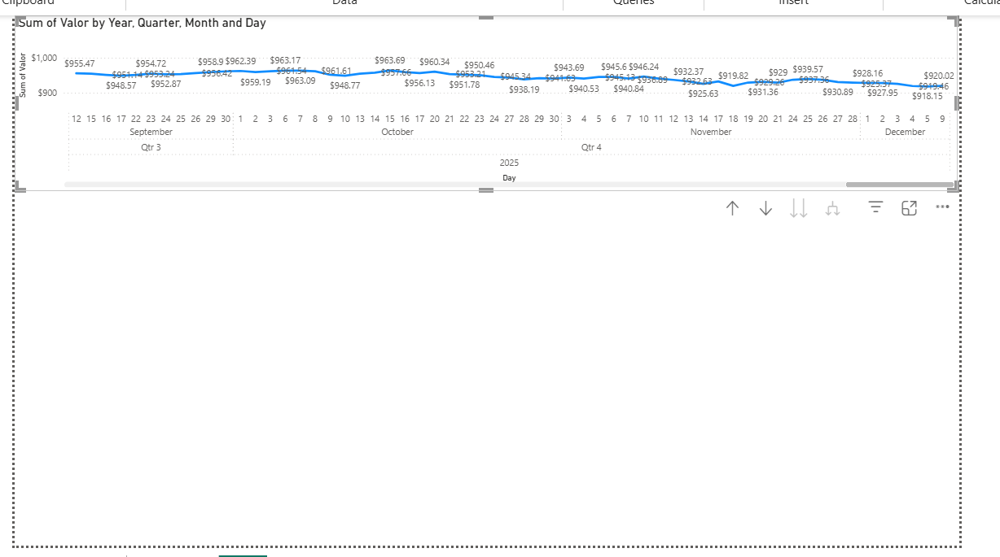
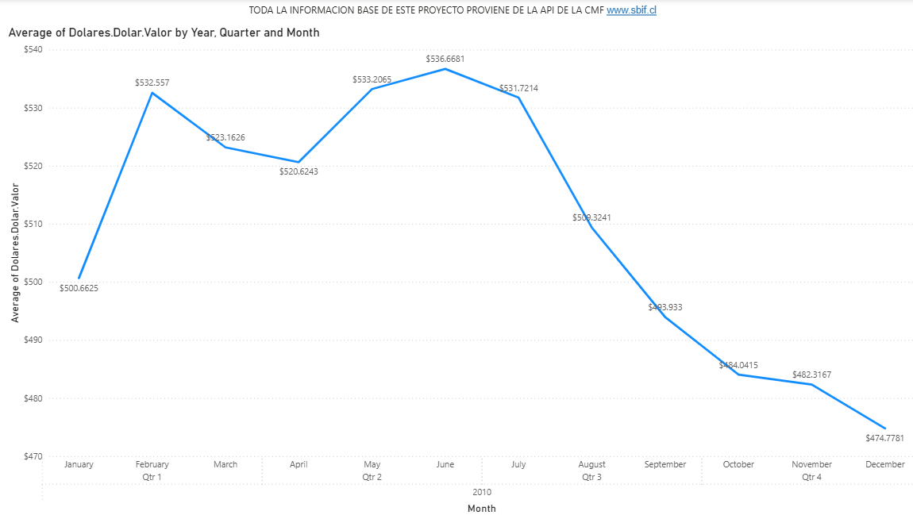

ESTE PROYECTO TIENE COMO OBETIVO DAR UNA PERSPECTIVA GENERAL DEL RIESGO FINANCIERO EN CHILE USANDO COMO FUENTES DE DATOS API'S PUBLICAS DE LA CMF, EL BANCO CENTRAL Y OTROS.

PROCESO:

HOY 07-12-2025 SE AGREGAR EL VALOR DOLAR DURANTE EL ANO 2010 PARA HACER PRUEBA DE CARGA

HOY 09-12-2025 SE CAMBIA VALOR DOLAR ANO 2010 POR VALORES 2024 Y 2025 POR LIMITANTES DE LA API, SOBRE ESTOS ANOS SE TRABAJARA

Se agregan lineas min, max y med al grafico dolar y se organizan tres hojas de trabajo, dimensiones "Mercado", "Liquidez" y "Credito"

HOY 10-12-2025 SE MEJORA GRAFICO DOLAR, SE AGREGA VALOR TMC, SE CREA UNA TABLA CALENDARIO  Y SE RELACIONAN

HOY 11-12-2025 SE AGREGAN DATOS DE VALOR COBRE E IPSA A TRAVES DE LA API DEL BANCO CENTRAL, SE LIMITA TODO A NOVIEMBRE POR TEMAS DE DISPONIBILIDAD DE DATOS DE LAS DISTINTAS VARIABLES

HOY 12-12-2025 SE MEJORA EL README DEL PROYECTO Y SE CAMBIA EL NOMBRE DEL ARCHIVO Y SE CREA UNA RAMA PARA TRABAJAR EN EL RIESGO DE LIQUIDEZ.

HOY 13-12-2025 SE AGREGA IMACEC NO MINERO, SE CREA UNA TABLA DE MEDIDAS, SE CREAN KPI'S CON LOS VALORES MAS ACTUALES POSIBLES DE LAS VARIABLES PRESENTADAS PARA ANALISIS (MAS UF Y UTM), CON ESTO SE DA POR TERMINADO EL DASHBOARD DE RIESGO FINANCIERO DE MERCADO EN CHILE.

