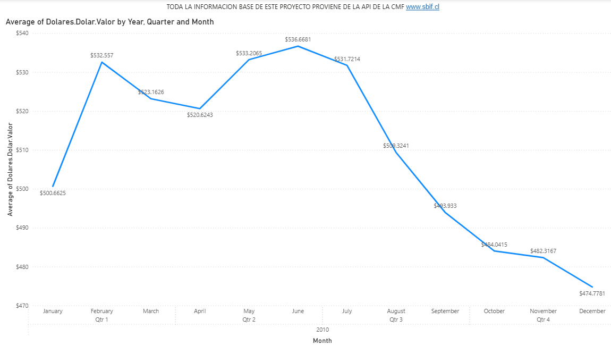
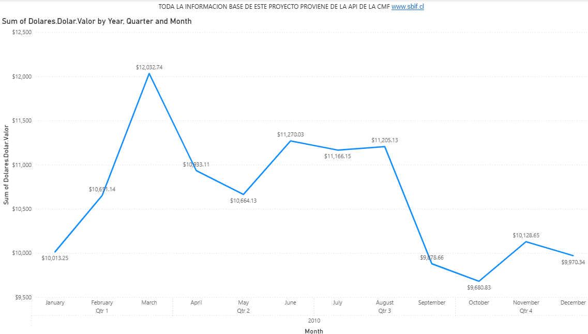

ESTE ARCHIVO SE ALIMENTA A TRAVES DE LA API DE CMF MAS INFORMACION EN www.sbif.cl

ESTE INFORME ESTA EN EPROCESO DE CREACION

HOY 07-12-2025 SE AGREGAR EL VALOR DOLAR DURANTE EL ANO 2010 PARA HACER PRUEBA DE CARGA

HOY 09-12-2025 SE CAMBIA VALOR DOLAR ANO 2010 POR VALORES 2024 Y 2025 POR LIMITANTES DE LA API, SOBRE ESTOS ANOS SE TRABAJARA

Se agregan lineas min, max y med al grafico dolar y se organizan tres hojas de trabajo, dimensiones "Mercado", "Liquidez" y "Credito"

